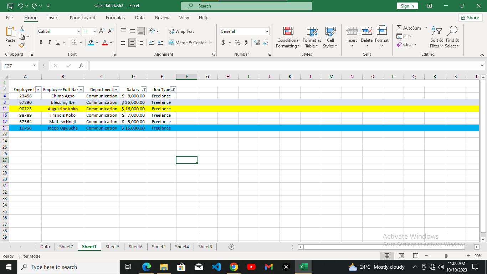
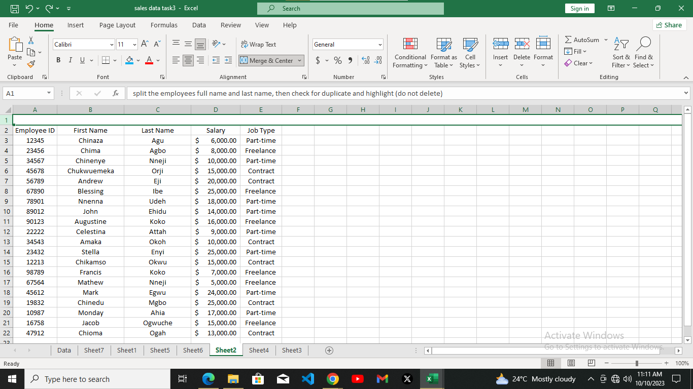
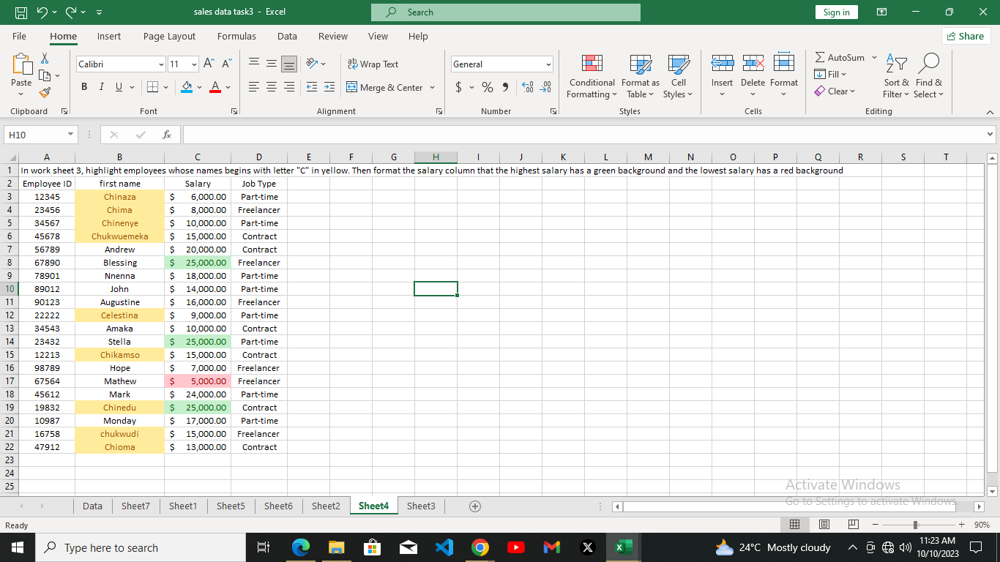
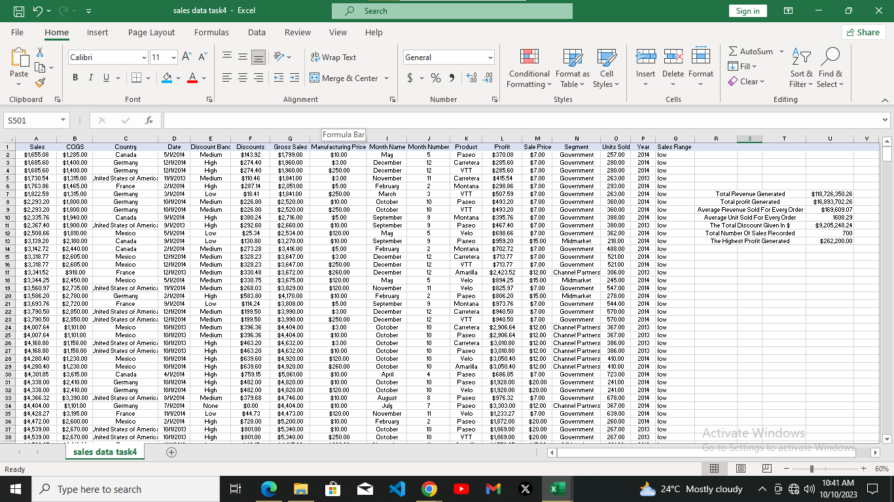

 In this sales data task 1, we were asked to show only employees who are freelancers and equally highlight those whose salaries are above $10,000.
 that was possible possible with the help of SORTING and FILTERING the job types and the salary range.

 In this sales data task 2, we were asked to split the employees full name into first name and last name.
 then check for duplicate and highlight if there is any. the splitting was equally made possible with the use of CONCAT

 
 
  In this sales data task 3, we were asked to highlight employees whose name begins with the letter "C" in YELLOW, then format the salary COLUMN such that the highest salary has a GREEN background and the lowest has a RED background. that too was equally possible with the help of CONDITIONAL FORMATING, SORTING AND FILTERING.

  
  
   In this sales data task 4, we were asked to determine the following in this data set:
 1a. The total revenue generated
 1b. The total profit generated
 2a.  The average revenue for every order
 2b. The average units sold for every order
 3. The total discount given in dollars
 4. total number of sales recorded
 5. The highest profit generated
 6. create a column named "sales range" return "high sales" if the sales value is above average, otherwise, return "low sales"

#### 1a. TOTAL REVENUE GENERATED:
it was possible by the summation of the SALES column with the formula =SUM(A2:A701) and it gives us $118,726,350.26

#### 1b. TOTAL PROFIT GENERATED:
it was equally possible by summing all the PROFIT column with the formula =SUM(L2:L701) and it gives us $16,893,702.26

#### 2a. AVERAGE REVENUE SOLD FOR EVERY ORDER:
which was possible by the calculation of the whole SALES and its formula is =AVERAGE(A2:A701) and it gives us $169,609.07

#### 2b. AVERAGE UNIT SOLD FOR EVERY ORDER:
it was possible by the use of the AVERAGE formula on the unit sold and the formula is =AVERAGE(O2:O701) and it gives us 1608.29

#### 3. TOTAL DISCOUNT GIVEN IN DOLLAR:
that too was possible by adding up all the DISCOUNT that was given using the formula =SUM(F2:F701) and it gives us $9,205,248.24

#### 4. TOTAL NUMBER OF SALES RECORDED:
that was possible by using the COUNT formula on every sales that was made which is =COUNT(A2:A701) and it gives us 700

#### 5. HIGHEST PROFIT GENERATED:
that was equally possible by using the MAXIMUM formula on every PROFIT that was made which is =MAX(L2:L701) and it gives us $262,200.00

#### 6. return high or low on a sales range column:
it can be easily identified with the "IF" formular. and it can be easily identified or gotten with the help of the formula that states =IF(A2>$U$9,"high","low")

## its widely open for REVIEW, THANKS FOR YOUR TIME.
